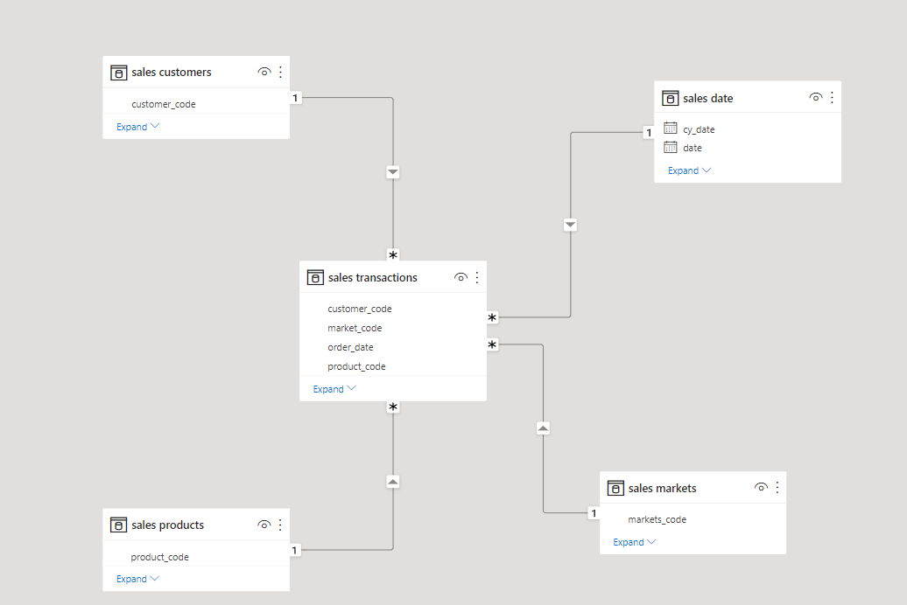

# Scenario.

AltiQ Hardware(fictitious) is a Computer Hardware and Peripheral Manufacturer. Head office is in Delhi.

Market is growing dynamically. The Sales Director is finding it difficult to track sales in the Regional Markets(North, South and Central)

# Stage 1: Ask.

## Requirement:

To unlock sales insights that are not visible before for Sales team for decision support and to automate them to reduced manual time spent in data gathering.

## Stakeholders:
* Sales Director, who is the primary stakeholder for this project.
* Marketing Team, they are secondary stakeholders.
* Data & Analytics Team, that has to create a dynamic dashboard and provide insights from the data gathered.
* IT team, that has the all the required data maintained in a MySQL server.

## Expectation: 

An automated dashboard providing quick and latest sales insights in order to support data driven decision-making.

## Success Criteria:

* Dashboards uncovering sales order insights with latest data available.
* Sales team able to take better decisions to prove 10% cost savings of the total spend.
* Sales analysts stop data gathering manually in order to save 20% of their business time and reinvest it in value added activity.

## Business Task:

Create an active dashboard that helps Sales Director track sales data every month which will help them make a data-driven decisions.

## Stack:
* Data source: MySQL table converted to .csv.
* Data processing: Python Pandas Library.
* Data Visualization: Tableau Public.

# Stage 2: Prepare.

## Data Source:

* The dataset provided by the AltiQ IT Team was stored in the MySQL Server owned by the team. The `.sql` file is available [here](https://raw.githubusercontent.com/samBoyySpirit/DataAnalysisProjects/master/2_SalesInsightsTableau/docs/db_dump_version_2.sql).
* Converted the `.sql` file to `.csv` files for processing stage in Pandas Library. The `.csv` files are available [here](https://github.com/samBoyySpirit/DataAnalysisProjects/tree/master/2_SalesInsightsTableau/docs).
* The reason we are converting `.sql` file to `.csv` files is that for data visualization, we are using Tableau public, which does not provide the feature of connecting to the MySQL server. It allows for the loading of `.csv` files.

## Organization of Data:

The tables in the database is organized in a *Star Schema*. It includes *one* fact table(sales.transactions) indexing *four* dimensional tables(sales.customers, sales.date, sales.products, sales.markets).

All the events and transaction related attributes are in the fact table and the remaining characteristics attributes are put in the dimension tables.

## Does the data need cleaning?

Yes, after quick initial analysis, the data is in need of cleaning. Here are the following issues observed in the dataset.
* In the sales.markets table, New York and Paris market has null values in zone.
* In the sales.transactions table, there are two records whose currency and sales amount has been listed in USD.
For more detailed cleaning documentation, check out the ...

# Stage 3: Process.

